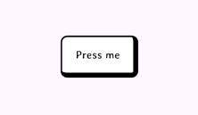
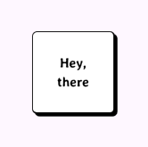
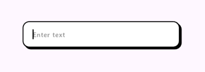
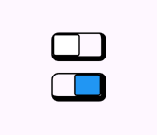
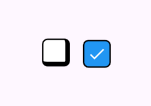
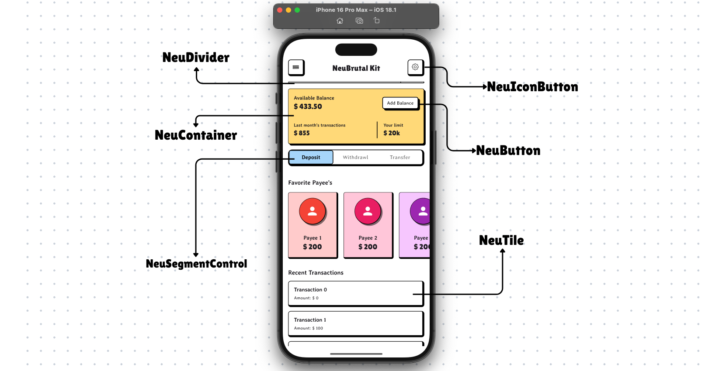

# ✨ NeuBrutal Kit

[](https://pub.dev/packages/neubrutal_kit)
[](https://opensource.org/licenses/MIT)

A modern Flutter package providing neubrutalism-styled UI components for creating distinctive, playful interfaces with bold shadows and vivid colors. This package offers a collection of customizable widgets that follow the blocky, bold, and colorful style of the neubrutalism design trend.


## 💫 Features

NeuBrutal Kit contains the following components:

- **NeuButton**: Bold, chunky buttons with customizable colors and shadow effects
- **NeuIconButton**: Icon buttons with the neubrutalism style
- **NeuDivider**: Custom dividers with neubrutalism styling
- **NeuContainer**: Container with neubrutalism styling for creating card-like elements
- **NeuSwitch**: Toggle switches with bold, chunky styling
- **NeuTile**: Tile components for lists
- **NeuRadio**: Radio buttons with neubrutalism styling
- **NeuCheckBox**: Checkboxes with bold borders and colors
- **NeuTextfield**: Text input fields with the signature thick borders
- **NeuSnackBar**: Bold, attention-grabbing snackbar notifications
- **NeuSlider**: Sliders with chunky knobs and tracks
- **NeuRangeSlider**: Range selectors with neubrutalism styling
- **NeuSegmentControl**: Segmented controls for multiple option selection
- **NeuLoading**: Loading indicators with the neubrutalism aesthetic

## 🎖 Installation

Add this to your package's pubspec.yaml file:

```yaml
dependencies:
  neubrutal_kit: ^0.0.1
```

Then run:

```bash
flutter pub get
```

## ⚡️ Usage

Import the package:

```dart
import 'package:neubrutal_kit/neubrutal_kit.dart';
```

### NeuButton

```dart
NeuButton(
  onPressed: () {
    print('Button pressed!');
  },
  child: Text('Click Me'),
)
```



### NeuContainer

```dart
NeuContainer(
  height: 100,
  width: 100,
  shadowColor: Colors.black,
  child: Text('Hey, there'),
)
```



### NeuTextfield

```dart
NeuTextfield(
  hintText: 'Enter text here',
  backgroundColor: Colors.white,
  borderColor: Colors.black,
  shadowColor: Colors.black,
  borderWidth: 3,
  shadowOffset: 4,
)
```



### NeuSwitch

```dart
NeuSwitch(
  value: _switchValue,
  onChanged: (value) {
    setState(() {
      _switchValue = value;
    });
  },
)
```



### NeuCheckBox

```dart
NeuCheckBox(
  value: _isChecked,
  onChanged: (value) {
    setState(() {
      _isChecked = value;
    });
  },
  activeColor: Colors.blue,
  borderColor: Colors.black,
)
```



## 🛠️ Customization

All widgets support extensive customization. Here are the common properties available across most components:

- `backgroundColor`: The main color of the component
- `borderColor`: The color of the border (typically black in neubrutalism)
- `borderWidth`: Thickness of the border
- `shadowColor`: Color of the offset shadow (typically black)
- `shadowOffset`: Distance the shadow is offset (creates the 3D effect)
- `borderRadius`: Roundness of corners (typically small in neubrutalism)

For more info, please, refer to the [showcase.dart](example/lib/showcase.dart) in the example.

## 🎮 Animations

This package leverages the [flutter_animate](https://pub.dev/packages/flutter_animate) package to add smooth animations to components. Many components include optional animation properties to enhance the user experience.

## Example App

Check out the [example](example) directory for a complete sample application showcasing all the components.

```dart
import 'package:flutter/material.dart';
import 'package:neubrutal_kit/neubrutal_kit.dart';

void main() {
  runApp(const MyApp());
}

class MyApp extends StatelessWidget {
  const MyApp({Key? key}) : super(key: key);

  @override
  Widget build(BuildContext context) {
    return MaterialApp(
      title: 'NeuBrutal Demo',
      home: Scaffold(
        appBar: AppBar(title: const Text('NeuBrutal Kit Example')),
        body: Center(
          child: Column(
            mainAxisAlignment: MainAxisAlignment.center,
            children: [
              NeuButton(
                onPressed: () {},
                child: const Text('NeuButton'),
                backgroundColor: Colors.yellow,
              ),
              const SizedBox(height: 16),
              NeuContainer(
                child: const Padding(
                  padding: EdgeInsets.all(16.0),
                  child: Text('NeuContainer'),
                ),
                backgroundColor: Colors.pink.shade100,
              ),
              // More examples...
            ],
          ),
        ),
      ),
    );
  }
}
```

## 📸 Showcase



## 🏗️ Contributing

Contributions are welcome and help make NeuBrutal Kit even better! Whether it's bug fixes, new features, or improvements to documentation, your input is highly appreciated.

## 🚀 Reporting Issues & Feature Requests

If you encounter any problems, please [open an issue](https://github.com/Mani821/neubrutal_kit/issues) on GitHub. If you think the library is missing a feature, raise a ticket and I'll look into it. Your feedback helps guide the project!

## 🔧 Creating a Pull Request

Follow these steps to contribute your changes:

- **Fork the Project:** Click the **Fork** button on the repository page.
- **Create a Feature Branch:**
- ```bash
  git checkout -b feature/AmazingFeature
  git commit -m "Add some AmazingFeature"
  git push origin feature/AmazingFeature
  ```
- **Open a Pull Request:** Choose the **Staging** branch from the dropdown when creating your PR.

Thank you for helping make **NeuBrutal Kit** awesome!

## ☀️ Authors
<div style="text-align: center;">
  <br />
  <sub><b>Imran Mani</b></sub><br />
  <div style="margin-top: 6px; display: flex; gap: 10px; align-items: center; justify-content: center;">
    <a href="https://github.com/Mani821">
      
    </a>
    <a href="https://linkedin.com/in/imran-farooq-8192b1238">
      
    </a>
  </div>
</div>

## ⭐️ License

This project is licensed under the MIT License - see the [LICENSE](LICENSE) file for details.